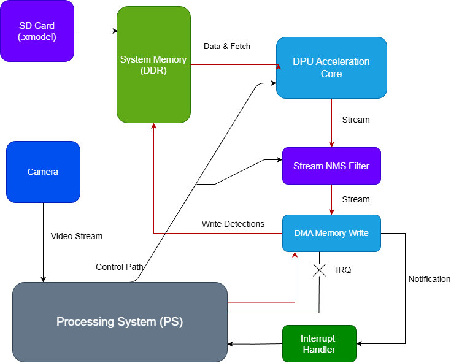
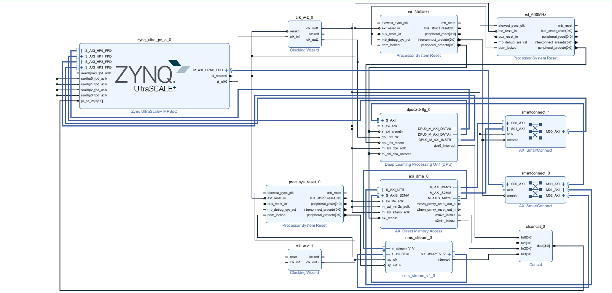
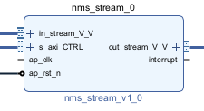
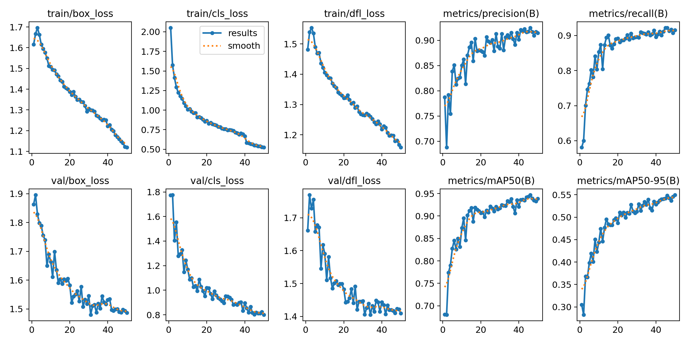
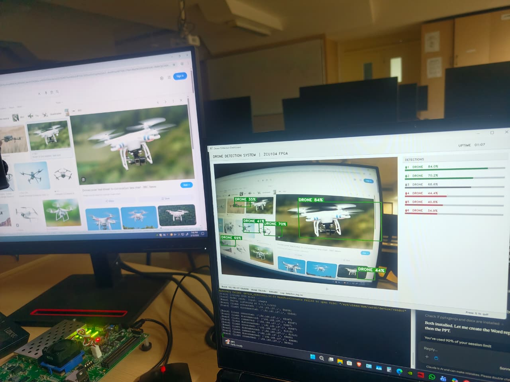
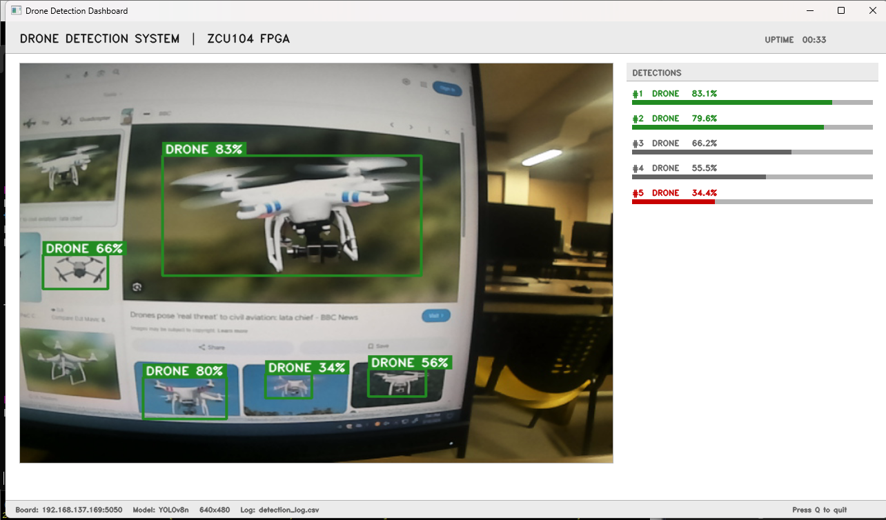

# FPGA-Based Drone Detection and Classification System Using YOLOv8n on ZCU104

Real-time FPGA-accelerated drone detection system using YOLOv8n, AMD Xilinx ZCU104, DPUCZDX8G, and a custom Vivado HLS-based NMS accelerator.

## Overview

This project implements a real-time FPGA-based drone detection and classification system using YOLOv8n deployed on the AMD Xilinx ZCU104 platform.

The system combines deep learning acceleration using the DPUCZDX8G accelerator with a custom hardware Non-Maximum Suppression (NMS) IP developed in Vivado HLS.

---

## Key Features

* Real-time drone detection
* YOLOv8n object detection network
* INT8 quantization using Vitis AI
* Deployment on ZCU104 FPGA platform
* Custom NMS Accelerator using Vivado HLS
* AXI4-Stream based hardware integration
* Reduced CPU overhead through hardware acceleration

---

## Hardware Platform

* AMD Xilinx ZCU104
* DPUCZDX8G Accelerator
* ARM Cortex-A53 Processing System
* Vivado Design Suite
* Vitis AI

---

## Design Flow

Dataset → YOLOv8 Training → ONNX Export → INT8 Quantization → DPU Compilation → FPGA Deployment → Custom NMS Accelerator → Detection Output

---

## Performance

### Quantized Model Performance

| Metric       | Value |
| ------------ | ----- |
| Precision    | 91.4% |
| Recall       | 91.6% |
| mAP@0.5      | 93.8% |
| mAP@0.5:0.95 | 54.9% |

---

## Custom NMS Accelerator

The NMS module was implemented using Vivado HLS and integrated into the FPGA design through AXI4-Stream interfaces.

Files:

* hls/nms_stream.cpp
* hls/tb_nms_stream.cpp

---

## Repository Structure

docs/ → Project documents

images/ → Architecture and results

hls/ → Custom NMS accelerator source code

results/ → Experimental results

---

## Project Architecture

### Overall System Architecture

### Vivado Block Design Integration

### Custom NMS Accelerator Architecture

---

## Training Results

The YOLOv8n model was trained on a custom drone dataset and optimized for FPGA deployment using Vitis AI quantization.

### Training Performance Curves

---

## Detection Results

Example drone detection outputs generated by the deployed FPGA system.

---

## FPGA Deployment Flow

Dataset
→ YOLOv8n Training
→ ONNX Export (`best.onnx`)
→ INT8 Quantization
→ DPU Compilation
→ ZCU104 Deployment
→ Custom HLS NMS Accelerator
→ Real-Time Drone Detection

---

## Source Code Organization

### HLS Accelerator

* `hls/nms_stream.cpp`
* `hls/tb_nms_stream.cpp`

### Models

* `models/best.onnx`
* `models/best.pt`

### Scripts

* `scripts/drone_detection_camera.py`
* `scripts/test_model.py`

### Documentation

* IEEE Conference Paper
* Project Presentation
* Final Report

## Technologies Used

- YOLOv8
- FPGA
- AMD Xilinx ZCU104
- DPUCZDX8G
- Vivado
- Vivado HLS
- Vitis AI
- AXI DMA
- AXI4-Stream
- ONNX
- Python
- C++

## Author

M. Surya Vardhan

M.Tech VLSI Design

VIT Chennai
